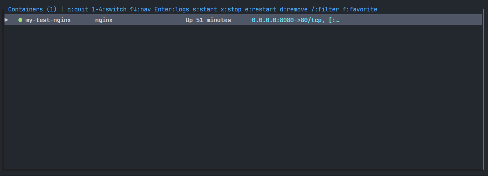
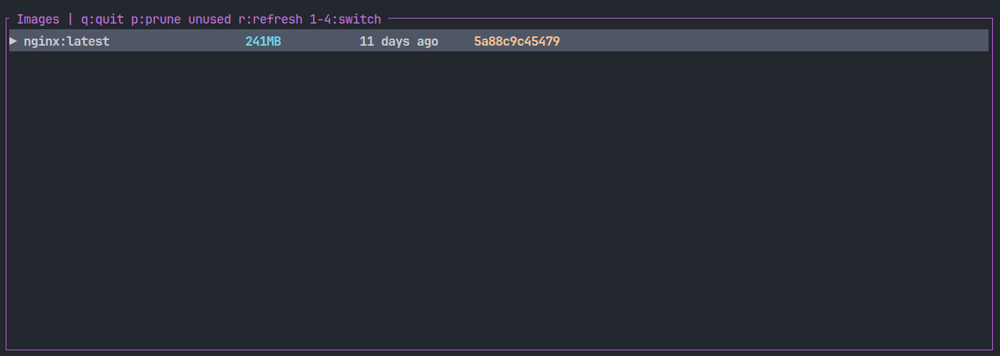
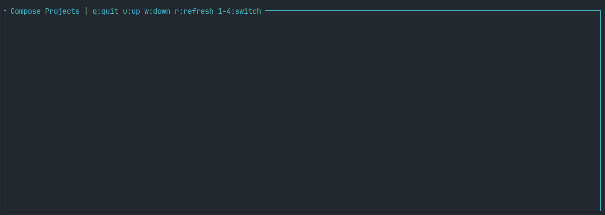
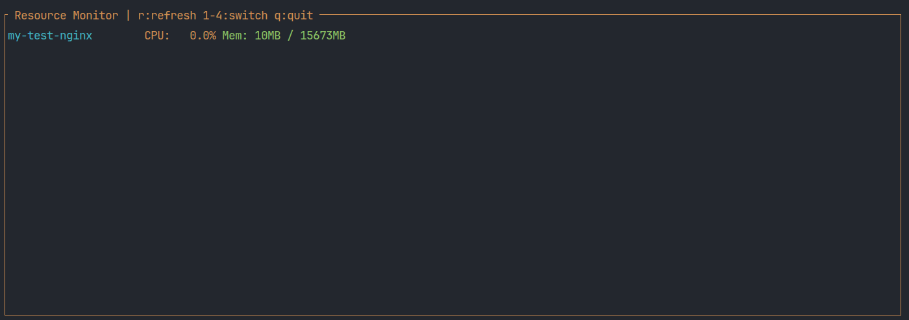
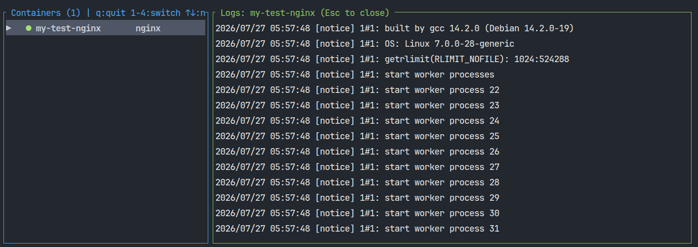

# docktui

Terminal Docker tool. Like `htop` but for containers.

## Features
- See running/stopped containers, images, compose projects
- Stream logs live
- Start, stop, restart, remove containers
- CPU/mem sparklines
- Filter and favorite containers

## Install
Grab binary for your platform from [Releases](https://github.com/YOUR_GITHUB_USERNAME/docktui/releases).

## Quick start
```bash
# Run binary
./docktui

# Or via Cargo, if Rust installed
cargo install docktui
```

## Demo

<p align="center">
  
  
</p>

<p align="center">
  
  
</p>

<p align="center">
  
</p>

## Keybindings
| Key | Action |
|---|---|
| ↑/↓ or j/k | Navigate |
| Enter | View logs |
| s / x / e / d | Start / Stop / Restart / Remove |
| / | Filter |
| 1-4 | Switch view (Containers, Images, Compose, Stats) |
| q | Quit |
